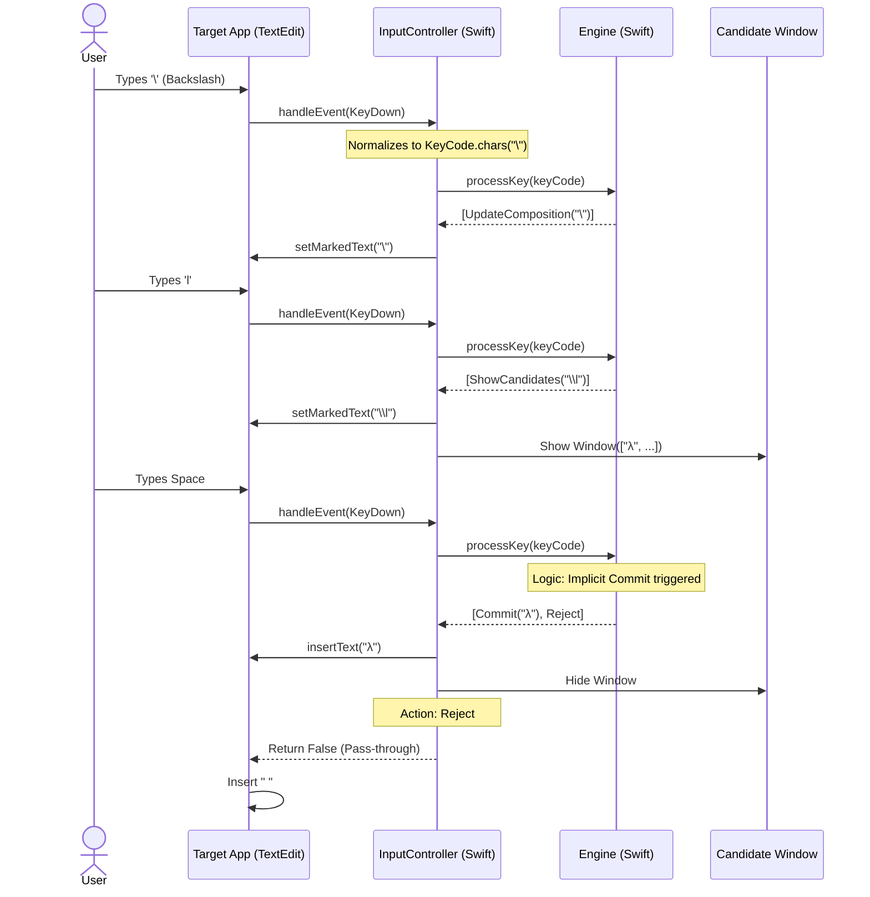

# Unicorn Input Method Specification

## 1. Architecture
Unicorn is a native macOS Input Method implemented in Swift. It adheres to a strict separation of concerns between the logic (`Engine`) and the system interface (`InputController`).

*   **Engine (Swift):** A deterministic state machine. It receives `KeyCode` events and returns a sequence of `EngineAction`s (Commit, Update, Show Candidates, Reject). It encapsulates all business logic, including implicit commits.
*   **KeyCode (Swift):** A type-safe enum that normalizes `NSEvent` key codes and modifiers, ensuring consistent handling of standard macOS text input rules (e.g., ignoring Command/Control shortcuts).
*   **InputController (Swift):** The system shell. It translates macOS events into `KeyCode`, feeds them to the `Engine`, and executes the returned actions.

## 2. Activation & Deactivation
*   **Activation:** Typing the backslash `\` character activates "Unicorn Mode".
*   **ABC Fallback:** When not in Unicorn Mode (no active buffer), all keys are passed through to the system, making Unicorn behave exactly like the default "ABC" input method.
*   **Deactivation:** 
    *   Committing a symbol.
    *   Implicitly committing due to invalid input.
    *   Pressing Escape or Backspace until empty.

## 3. Engine State Transition (Priority Order)

When a key is pressed, it is converted to a `KeyCode` and passed to `Engine.processKey`. The Engine applies the following priority logic:

### A. Navigation & Control
*   **Arrows:** Update the internal selection state (`CandidateWindow`). Returns `.navigate` action.
*   **Enter:** Commits the current selection or buffer.
*   **Backspace:**
    *   **Standard:** Removes the last character from the buffer.
    *   **Undo:** If the buffer becomes empty and there is history from a previous "Soft Commit", restores the previous state.
    *   **Deactivate:** If the buffer is empty and history is empty, deactivates.

### B. Trie Continuation
The engine checks if the key extends the current buffer to a valid path in the Keymap (Trie).
*   **Match:** The key is consumed and added to the buffer.
    *   Returns `.updateComposition` (and optionally `.showCandidates` if ambiguities exist).
*   **Leaf:** If the new path is a leaf node (no further children):
    *   **Single Candidate:** The candidate is automatically **Committed**.
    *   **No Candidate:** The raw buffer is **Committed**.

### C. Special Keys (`\`)
If the key is not a valid Trie continuation, the engine checks for the Backslash trigger.
*   **Backslash (`\`):**
    *   Acts as a **Sequence Terminator** and **Soft Commit** command.
    *   **Logic:**
        *   **If Symbol Selected:** Soft-commits the selected candidate (moves to `committedPrefix`).
        *   **If No Match:** Hard-commits the `committedPrefix` + `buffer` + `\` (mimicking a Reject).
    *   **Result:** Starts a new sequence with `\` in the buffer. If a Soft Commit occurred, the composition session remains continuously active.

### D. Candidate Selection (Numeric)
If the key is a digit (1-9) AND candidates are currently visible:
*   The key acts as a selection command.
*   **Action:** The candidate at the corresponding index is **Committed**, and the engine resets.

### E. Implicit Commit (Rejection Logic)
If the key is not a valid Trie continuation, not a control key, and not a selection command:
1.  **Implicit Commit:** The engine determines the "best match" for the *current* buffer (Selected Candidate > First Candidate > Raw Buffer).
2.  **Action Sequence:** The engine returns `[.commit(text), .reject]`.
    *   `.commit(text)`: The InputController inserts the best match.
    *   `.reject`: The InputController returns `false` to macOS, causing the system to insert the original invalid key (e.g., Space, punctuation).

### 🔄 Interaction Flow

The following diagram illustrates how a keystroke travels from the user to the application:

## 4. UI Behavior & Navigation
*   **Composition:** Underlined text showing the current buffer (e.g., `\lambda`).
*   **Candidates Window:** A floating window appearing when multiple options exist.
*   **Paging:** Handled by `CandidateWindow` logic (Page Up/Down jumps by page size).

## 5. Ambiguity Resolution (Numbers)
Scenario: User types `(1)`.
1.  `(`: Valid. Buffer `(`. Candidates: `["(", "⊂", ...]`.
2.  `1`: Is `(1` a valid path? **Yes.**
    *   **Trie Continuation takes precedence.** The `1` is added to the buffer.
3.  `)`: Is `(1)` a valid path? **Yes.**
    *   Buffer `(1)`. Leaf node -> Commit `⑴`.

Scenario: User types `\l1`.
1.  `\`: Valid.
2.  `l`: Valid. Buffer `\l`. Candidates `["λ", ...]`.
3.  `1`: Is `\l1` a valid path? **No.** (Reject).
4.  **Fallback to Candidate Selection:** `1` is a digit. Candidates are visible. **Select Candidate 1.** Result: `λ`.

## 6. Security & Limits
*   **Input Buffer Limit:**
    *   To prevent memory exhaustion attacks (DoS) or abnormal behavior from corrupted keymaps, the Engine enforces a hard limit on the input buffer size.
    *   **Constraint:** `MAX_BUFFER_LENGTH = 50` characters.
    *   **Behavior:** If the buffer reaches this limit, any further input is rejected (`.reject`) regardless of whether it matches a valid path in the Trie. This effectively forces a commit or cancellation of the current sequence.
