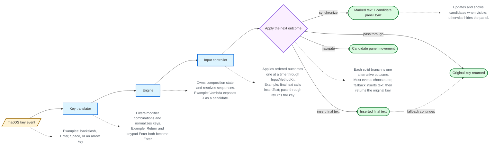

# Unicorn Input Method Specification

This index and the modules under [`docs/specs/`](specs/) are the canonical description of Unicorn's current architecture and implemented behavior. Future behavior must be labeled explicitly and must not be stated as an existing capability.

## Architecture

Unicorn is a native macOS input method implemented in Swift. Its **Pure Core, Impure Shell** design has three tiers:

1. **Domain logic (`Engine`):** A deterministic state machine that receives normalized `KeyCode` values, traverses the symbol trie, maintains composition `history`, and produces `EngineAction` intents.
2. **Presentation model (`EngineState`):** Pure derived values for composition text, selection range, candidate visibility, and candidate selection.
3. **Framework shell (`InputController`):** The macOS and `InputMethodKit` boundary that translates `NSEvent` values, sends normalized input to the engine, and executes actions through `IMKTextInput` and `IMKCandidates`.

The flow below shows component boundaries and possible outcomes for one key event. Solid output branches are alternatives, except that invalid-input fallback inserts resolved text and then returns the original key. The detailed specifications remain authoritative for processing priority and edge cases.

```mermaid
flowchart LR
  A[/"macOS key event"/] --> B["Key translator"] --> C["Engine"] --> D["Input controller"]
  D --> Q{"Apply the next outcome"}
  Q -->|"synchronize"| F(["Marked text + candidate panel sync"])
  Q -->|"insert final text"| G(["Inserted final text"])
  Q -->|"navigate"| H(["Candidate panel movement"])
  Q -->|"pass through"| I(["Original key returned"])
  G -. "fallback continues" .-> I

  FN["Updates and shows candidates when visible; otherwise hides the panel."]
  AN["Examples: backslash, Enter, Space, or an arrow key"]
  BN["Filters modifier combinations and normalizes keys.<br/>Example: Return and keypad Enter both become Enter."]
  CN["Owns composition state and resolves sequences.<br/>Example: \lambda exposes λ as a candidate."]
  DN["Applies ordered outcomes one at a time through InputMethodKit.<br/>Example: final text calls insertText; pass-through returns the key."]
  ON["Each solid branch is one alternative outcome.<br/>Most events choose one; fallback inserts text, then returns the original key."]

  F -.-> FN
  A -.-> AN
  B -.-> BN
  C -.-> CN
  D -.-> DN
  Q -.-> ON

  classDef external fill:#fff4d6,stroke:#9a6700,stroke-width:2px
  classDef component fill:#ddf4ff,stroke:#0969da,stroke-width:2px
  classDef result fill:#dafbe1,stroke:#1a7f37,stroke-width:2px
  classDef decision fill:#fbefff,stroke:#8250df,stroke-width:2px
  classDef note fill:transparent,stroke:transparent,color:#57606a
  class A external
  class B,C,D component
  class Q decision
  class F,G,H,I result
  class FN,AN,BN,CN,DN,ON note
```

## Specification Modules

| Module | Canonical subject |
| --- | --- |
| [Activation and Deactivation](specs/activation.md) | Activation, pass-through, commit, rejection, deactivation, and InputMethodKit lifecycle behavior |
| [Engine Logic and State Transitions](specs/engine.md) | State, processing order, trie traversal, fallback, paging, and undo history |
| [UI Behavior and Presentation](specs/ui.md) | Marked text, candidate-panel synchronization, and navigation |
| [Security and Distribution](specs/security_and_distribution.md) | Current signing and artifact evidence, installer behavior, and automation |

Contributor navigation and canonical ownership across repository documents are defined in [`AGENTS.md`](../AGENTS.md). Documentation changes follow the [`Documentation Guide`](DOCUMENTATION_GUIDE.md).
