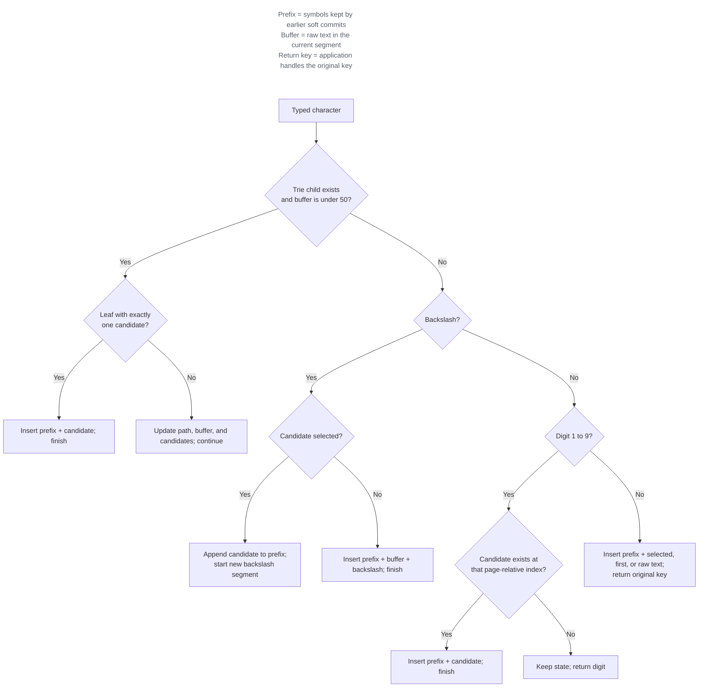

# Engine Logic and State Transitions

`Engine` is Unicorn's deterministic state-transition core. The public `processKey` method applies a normalized `KeyCode` to the current state and returns ordered `EngineAction` intents for the framework shell.

## Normalized Inputs and Outcomes

`KeyCode` is the engine's normalized input model. It represents directional keys, Backspace, Enter, or a `.chars` string payload.

`EngineAction` is an ordered outcome that the framework shell applies:

- `.sync` requests marked-text and candidate-panel synchronization after state changes.
- `.navigate` requests candidate movement.
- `.commit` provides final text to insert.
- `.reject` returns the original key event to macOS.

`Trie` is the immutable symbol-lookup tree decoded from [`keymap.json`](../../unicorn/keymap.json); each node contains character children and optional candidates.

## State

`EngineState` contains the complete logical composition state:

- **`path`:** The trie nodes traversed after activation. The first element is the trie root; the activation backslash is stored in the `buffer` but does not advance the trie `path`.
- **`buffer`:** Raw text entered for the current segment, including its leading backslash.
- **`committedPrefix`:** Candidate text accumulated by soft commits during the current marked-text session.
- **`active`:** Whether Unicorn is capturing a composition.
- **`candidateWindow`:** The candidate list, selected index, first visible index, and page size.
- **`history`:** Prior `EngineState` snapshots used by Backspace. Each stored snapshot has its own `history` cleared to avoid recursive growth.

A terminal commit or explicit deactivation replaces this state with an inactive, empty state rooted at the trie root.

## Processing Order

When `processKey` receives input while inactive, only a character payload consisting of a single backslash proceeds to the reducer. Other normalized keys return no actions.

For `active` input, the reducer applies the rules below in order. The diagram summarizes character processing; the prose that follows is authoritative for state details and edge cases.

### Navigation and controls

- Up and Down update the selected candidate by one position and return `.navigate`.
- Left and Right update the engine's nine-item paging state and return `.navigate(.pageUp)` or `.navigate(.pageDown)`.
- Navigation changes `candidateWindow` but does not create a `history` snapshot.
- Enter and Backspace use the commit and undo rules in [Activation and Deactivation](activation.md).

### Character payloads

A `.chars` payload is reduced one character at a time. For each character:

1. **Trie continuation:** The engine first attempts to follow a child of the current trie node, but only while the existing `buffer` contains fewer than 50 characters.
2. A successful non-auto-committing step appends the node and character, rebuilds the candidate state from that node, records the preceding state in `history`, and returns `.sync`.
3. A reached leaf commits automatically only when it has exactly one candidate. A terminal leaf with multiple candidates remains `active` through the step in rule 2 so the user can select a candidate.
4. If trie continuation fails, backslash handling runs next, followed by numeric selection, then invalid-input fallback.

Because trie continuation runs first, a backslash or digit that is a valid child of the current node extends the sequence instead of invoking its special handler.

### Soft commit and backslash fallback

When trie continuation fails for backslash:

- A selected candidate is appended to `committedPrefix`; the `path` and `candidateWindow` reset, the `buffer` becomes `\`, the preceding state is recorded in `history`, and the engine returns `.sync` while remaining `active`.
- Without a selected candidate, the engine commits `committedPrefix` + `buffer` + `"\\"` and resets. The triggering backslash is part of the committed text and is not rejected.

### Numeric selection

When trie continuation fails for a digit from `1` through `9`, the engine adds the digit's zero-based offset to `firstVisibleIndex`. A valid resulting candidate commits immediately. An invalid index returns `.reject` without resetting the state.

### Invalid-input fallback

For any remaining character, the engine chooses the selected candidate, then the first candidate, then the raw `buffer`. It returns `.commit` with `committedPrefix` plus that resolution, followed by `.reject`, in that order, and resets its state. `InputController` inserts the resolution and returns the original event to macOS.

## History and Backspace

The `history` stack is capped at 100 snapshots. Activation, successful trie steps that do not auto-commit, and successful soft commits add snapshots. Leaf auto-commits, navigation, terminal commits, rejected numeric selections, and invalid-input fallback do not add snapshots.

Backspace pops the newest snapshot and retains the remaining `history`. If no snapshot is available, it manually removes the last `buffer` character and, when possible, the last trie-`path` node. See [Activation and Deactivation](activation.md#backspace) for the deactivation conditions.

## Runtime Bounds

The current `buffer` limit is 50 characters, including the activation backslash. A trie step is allowed only while the existing `buffer` contains fewer than 50 characters. Once the `buffer` has reached 50, the next character cannot extend the trie and instead follows the backslash, digit, or invalid-input fallback path described above.
